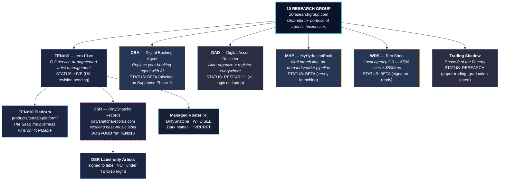

# 10 Research Group — Business Hierarchy

**Date:** 2026-04-30
**Status:** Single canonical product/positioning chart. Visio-style.
**Companion to:** `HIERARCHY.md` (which maps the *filesystem*, not the business).

If a deck, doc, or memory file describes the business differently than this — that other artifact is stale and needs to be updated to match this one.

---

## The chart



---

## ASCII fallback (same chart, no rendering needed)

```
┌──────────────────────────────────────────────────────────────────┐
│                    10 RESEARCH GROUP                             │
│                  10researchgroup.com                             │
│      Umbrella for portfolio of agentic businesses                │
└──────────────┬───────────────────────────────────────────────────┘
               │
   ┌───────────┼───────────┬──────────┬──────────┬──────────┐
   ▼           ▼           ▼          ▼          ▼          ▼
┌──────┐   ┌──────┐    ┌──────┐   ┌─────┐   ┌──────┐   ┌────────┐
│TENx10│   │ DBA  │    │ DAD  │   │ MHP │   │ WRS  │   │Trading │
│ LIVE │   │ BETA │    │ RSCH │   │ BETA│   │ BETA │   │ Shadow │
└──┬───┘   └──────┘    └──────┘   └─────┘   └──────┘   │  RSCH  │
   │                                                    └────────┘
   │  (Management-first, software secondary)
   │
   ├──► TENx10 Platform  (products/tenx10-platform/ — the SaaS)
   │
   ├──► DSR — DirtySnatcha Records  ◄── DOGFOOD
   │       │
   │       └──► DSR label-only artists (releases only, not managed)
   │
   └──► Managed Roster (4)
           ├── DirtySnatcha   (Leigh Bray)           flagship
           ├── WHOiSEE        (Brett Hopkin)
           ├── Dark Matter    (Tullos + Kalina)      Wakaan label
           └── HVRCRFT        (TBD)

       Kotrax is NOT managed — DSR label-only (is_managed=false).
```

---

## Status legend

| Tag | Meaning |
|---|---|
| **LIVE** | Customer-facing, generating revenue |
| **BETA** | Built or partial; not yet customer-facing |
| **RESEARCH** | Specs / partial scaffolding only |
| **DOGFOOD** | Internal proof-of-concept that drives the product |

---

## How to read this

1. **10 Research Group** is the parent brand. Site is a hierarchy index — one page linking to each product. Sandbox-quality is fine for now.

2. **TENx10** leads with management capability, not software. Pitch order is:
   - "We manage artists. Here's the roster. Here's the revenue."
   - "We do this at scale because we built our own platform."
   - "License the platform separately if you'd rather DIY."
   The reverse order (software first) is what every other AI-music tool does. It commoditizes immediately.

3. **DSR is the dogfood** — real artists, real shows, real revenue. DSR generates the operational reality that justifies every TENx10 platform feature. The label IS the proof + the training corpus + the moat.

4. **DBA, DAD, MHP, WRS, Trading Shadow** are sibling products under the umbrella — not sub-products of TENx10. Each gets its own surface as it ships.

5. **Two distinct rosters inside DSR:**
   - **Managed roster** — TENx10 manages end-to-end (booking, releases, royalty admin, content)
   - **Label-only roster** — signed to DSR for releases only, not under TENx10 management

6. **DSR is a CLIENT of TENx10, not a subsidiary.** DSR is co-owned by **Leigh Bray (70%)** and **Thomas Nalian (30%)** as a separate entity. TENx10 the management firm doesn't own DSR; DSR uses TENx10 for **partial management services** and uses the **TENx10 platform** (the SaaS) to run label ops. The chart's "TENX --> DSR" arrow is a service-relationship line (TENx10 serves DSR as a client), not a parent-subsidiary line. **DirtySnatcha (the artist) is Leigh Bray** (NOT Thomas — they're two different people); Thomas manages DirtySnatcha for 10% of artist gross income, separate from his DSR equity stake. No DSR distributions to either owner yet — earnings accumulate in the label entity. Full ownership detail: `MANAGEMENT-TENx10/labels/DirtySnatcha Records/BRAIN.md` § Ownership.

---

## Cross-references (canonical sources)

- Filesystem map: `HIERARCHY.md`
- Positioning spec: `docs/superpowers/specs/2026-04-30-positioning-and-site-hierarchy.md`
- Management business: `MANAGEMENT-TENx10/BRAIN.md`
- Label business: `MANAGEMENT-TENx10/labels/DirtySnatcha Records/BRAIN.md`
- Platform code: `products/tenx10-platform/`

---

*BUSINESS_HIERARCHY.md v1 — 2026-04-30. The single canonical business chart. If something contradicts this, update that thing — don't make a new variant.*
