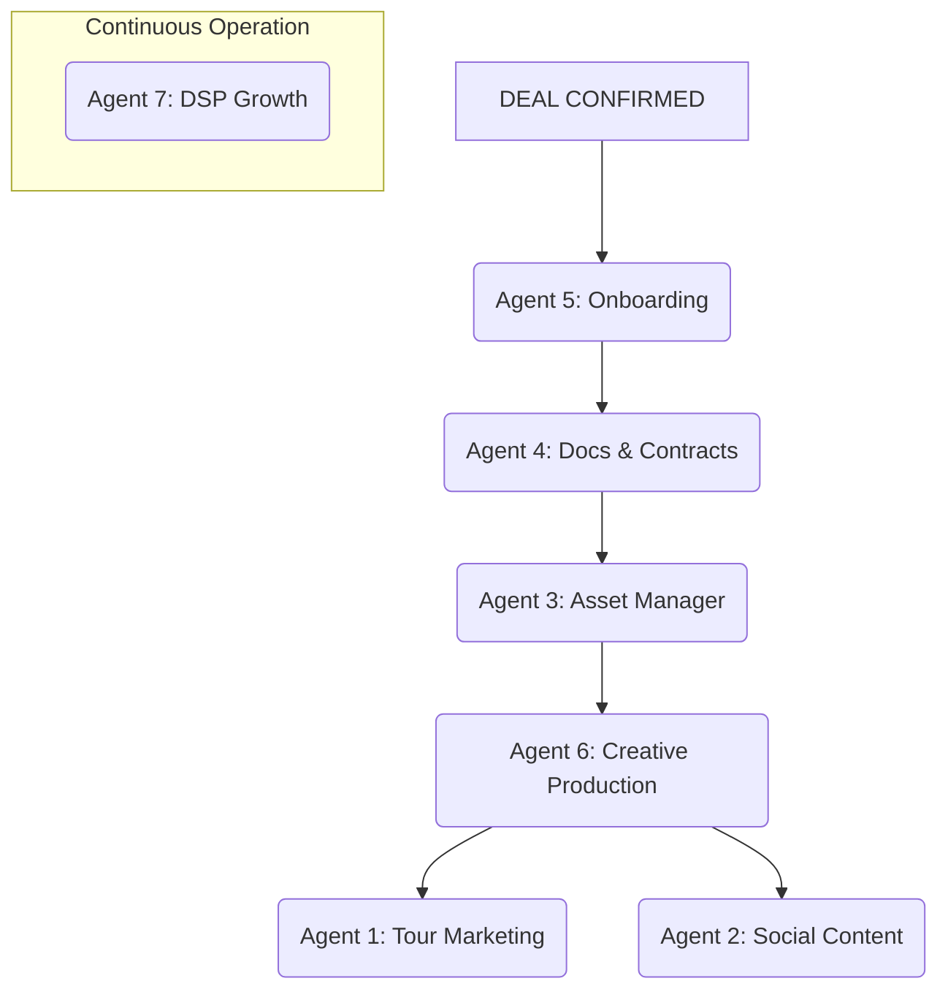

# Project Handoff: Artist Bible Agent System

**TO:** Claude AI
**FROM:** Manus AI
**DATE:** 2026-02-26
**SUBJECT:** Complete Context & Immediate Action Plan for DirtySnatcha Tour Marketing Automation

---

## 1. SITUATION BRIEF

This document contains the complete context for a 7-agent AI system designed to automate the entire tour marketing lifecycle for a music artist. The project is currently in the initial build phase. The user wants to transfer this project to you for higher-level reasoning, strategy, and continued development.

**The immediate situation is critical.** We are using a real-world test case: **DirtySnatcha's 2026 National Tour**. The show in **Lincoln, NE is tomorrow, February 27th, 2026**, and is in the "Final Push" marketing phase. It requires an immediate ad campaign launch.

Your primary objective is to absorb this context and immediately execute the steps required to launch the Lincoln campaign.

## 2. THE 7-AGENT SYSTEM ARCHITECTURE

We have co-designed a 7-agent system. Each agent has a specific, non-overlapping role. They work in a pipeline, triggered by events in the tour lifecycle.

| ID | Agent Name | Role & Purpose |
|:---|:---|:---|
| **1** | **Tour Marketing** | **The Revenue Engine.** Manages paid ad campaigns (Meta, TikTok, Google, etc.) and email/SMS blasts. Its goal is to sell tickets and report on Cost-Per-Ticket-Sold (CPT). |
| **2** | **Social Media Content** | **The Brand Builder.** Manages the artist's organic social media (posts, stories, reels). Operates on a content calendar, not just show dates. Focuses on engagement and audience growth. |
| **3** | **Asset Manager** | **The Prep Cook.** Collects, organizes, and verifies all raw creative materials (artwork, photos, logos) from promoters and artists. Ensures assets are approved and accessible before they are needed. |
| **4** | **Documents & Contracts** | **The Compliance Backbone.** Tracks all legal and financial documents: signed contracts, riders, deposit payments, settlement sheets. Prevents shows from being announced without proper paperwork. |
| **5** | **Show Onboarding** | **The Setup Crew.** Triggered when a deal is confirmed. Automatically creates Google Drive folders, archives the booking email thread, builds a contact sheet, and sends a professional marketing expectations letter to the promoter. |
| **6** | **Creative Production** | **The Rendering Engine.** Takes approved raw assets from Agent 3 and automatically generates finished marketing materials in all required formats (1:1 for feed, 9:16 for stories, 16:9 for video). |
| **7** | **DSP & Audience Growth** | **The Farmer.** Proactively builds the artist's audience in tour markets by analyzing DSP (Spotify, Apple Music) data and running targeted music promotion campaigns 60-90 days *before* a show is even announced. |

## 3. THE WORKFLOW PIPELINE

The agents operate in a specific sequence:

1.  A deal is confirmed.
2.  **Agent 5** sets up the entire show infrastructure.
3.  **Agent 4** verifies the contracts and financials are in place.
4.  **Agent 3** chases and collects the raw artwork.
5.  **Agent 6** produces the finished flyers and videos.
6.  **Agents 1 & 2** receive the finished assets and launch the paid and organic marketing campaigns.
7.  **Agent 7** runs continuously in the background, building audiences in future markets.

## 4. PLATFORM INTEGRATIONS & SKILLS

-   **Platforms:** The system is designed to integrate with Meta (FB/IG), TikTok, X (Twitter), Snapchat, YouTube, Google Ads, Google Analytics, and Email/SMS platforms.
    -   **Current Status:** Only the `meta-marketing` MCP tool is fully connected for ad execution. All other platforms are in the "planning" stage (the agent can create the plan, but execution is manual until APIs are connected).
-   **Skills:** Agents are equipped with modular skills for expert-level knowledge.
    -   **Key Skill:** `meta-ads-analyzer`. This is a critical skill that allows Agent 1 to interpret Meta Ads data correctly, avoiding common pitfalls like the "Breakdown Effect." It provides intelligent analysis, not just raw numbers.
    -   **Core Skills:** We have also scaffolded skills for budget allocation, ad copy generation, geo-targeting, and more.

## 5. THE IMMEDIATE TASK: LINCOLN, NE - FINAL PUSH

This is your first priority. You must use the existing agent structure to launch the ad campaign for the Lincoln show.

-   **Show:** DirtySnatcha @ Cosmic Eye, Lincoln, NE
-   **Date:** 2026-02-27 (Tomorrow)
-   **Phase:** Final Push (50% of marketing budget allocated)
-   **Goal:** Drive last-minute ticket sales.

**You have access to the following tools:**

-   The scaffolded `artist_bible_platform` codebase.
-   The skills library, including `meta-ads-analyzer`.
-   The parsed tour data.
-   The `meta-marketing` MCP tool for executing Meta ad campaigns.

**Your next action should be to begin the step-by-step process of building and launching this campaign.** Refer to the `implementation_guide.md` in the handoff package for the precise sequence of skill and tool calls.
