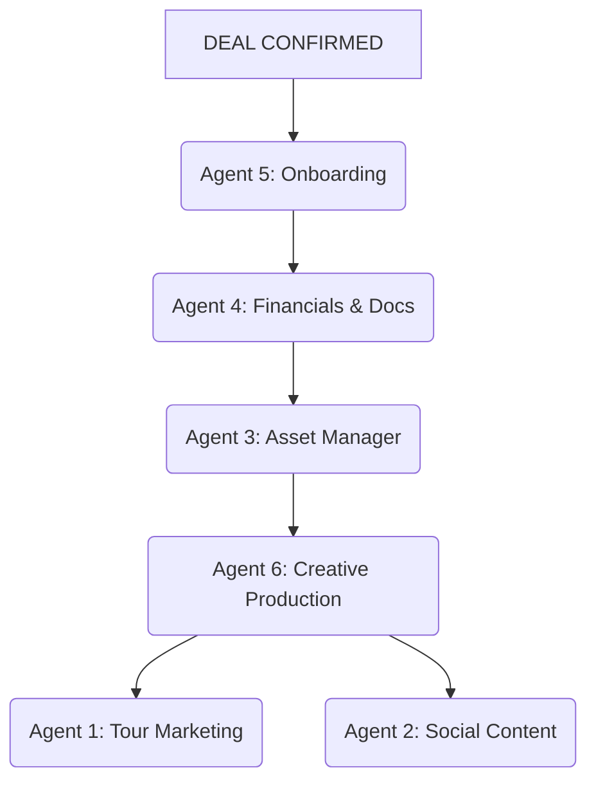

# Project Handoff: Artist Bible Agent System (UPDATED)

**TO:** Claude AI
**FROM:** Manus AI
**DATE:** 2026-02-26
**SUBJECT:** Enhanced Architecture & Immediate Action Plan for DirtySnatcha Tour

---

## 1. SITUATION BRIEF (UPDATED)

This document contains the complete context for a 7-agent AI system designed to automate the entire tour marketing lifecycle. We have updated the architecture to include **deep financial tracking** and a **dynamic tour support grid**.

**The immediate situation is critical.** DirtySnatcha's show in **Lincoln, NE is tomorrow, February 27th, 2026**. It is in the "Final Push" phase.

## 2. NEW ARCHITECTURAL REQUIREMENTS

Based on real-world needs, the following data points must be integrated into the agent logic:

### A. Financial & Contractual Tracking (Agent 4)
Agent 4 (Documents & Contracts) must now track and report on:
- **Contract Type:** (Flat, VS, Bonus structure)
- **Payment Status:** Has the deposit been made? When is the final payment due?
- **Bonus Amounts:** Specific thresholds and payout amounts.
- **Merch Details:** Is merch sold at the show? What is the venue/artist percentage split?

### B. Tour Support Grid (Agent 5 & 6)
We have a master support grid (`project_context/tour_support_grid.json`) that dictates:
- **Support Artists:** Who is playing each date (Special Guest, Support 1, 2, 3, 4).
- **Marketing Emails:** These artists must be included in the marketing email threads.
- **Automated Assets:** Agent 6 (Creative Production) must use this grid to **autocreate flyer assets** that include the specific touring artists and venue location information for each stop.

## 3. UPDATED WORKFLOW PIPELINE

1. **Agent 5 (Onboarding):** Now uses the support grid to include all support artists in the initial marketing email thread.
2. **Agent 4 (Financials):** Tracks the deposit status and flags if payment is missing before the show date.
3. **Agent 6 (Creative):** Pulls the support grid to bake the correct artist names and venue info into the show assets.

## 4. IMMEDIATE ACTION: LINCOLN, NE

- **Show:** DirtySnatcha @ The Royal Grove, Lincoln, NE
- **Date:** 2026-02-27
- **Phase:** Final Push
- **Support:** Refer to `tour_support_grid.json` for the support lineup.
- **Financials:** Verify if the deposit for Lincoln has been marked as "Paid" in the system.

**Next Steps for Claude:**
1. Read the updated `tour_support_grid.json`.
2. Update the `Agent 4` and `Agent 5` logic to handle the new financial and support fields.
3. Execute the Lincoln Final Push campaign using the `meta-marketing` MCP tool.
